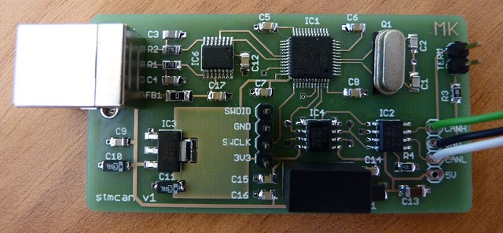
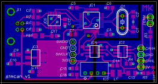
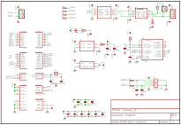
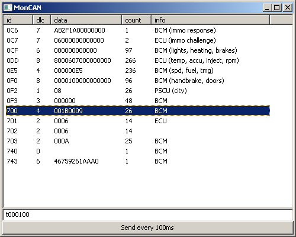

### USB to CAN

I started this project to research CAN messages bouncing around my car.
To compile the sources, my STM32F10x library is required.



The CAN interface is isolated from the USB using a DC-DC converter and Analog's excellent ADUM1201.
Although the STM32F103 MCU supports USB natively, it unfortunately cannot use USB and CAN at the
same time. The USB to serial conversion is therefore done by FT230XS IC.

The project is an isolated alternative to [USBtin](http://www.fischl.de/usbtin/). It implements the
same frontend protocol (SLCAN).

#### Bill of materials

[](images/stmcan_brd.png)
[](images/stmcan_sch.png)

Qty | Value / Farnell code | Device | Size | Parts
----|----------------------|--------|------|------
1 | green   | chipled      | 0805   | LED1
1 |         | ferrite bead | 1206   | FB1
1 | 47uH    | choke        | 1210   | L1
1 | 8 MHz   | crystal      | HC49   | Q1
1 | 4u7     | multilayer   | 1206   | C13
1 | 10n     | multilayer   | 0805   | C9
2 | 22p     | multilayer   | 0805   | C1, C2
2 | 47p     | multilayer   | 0805   | C3, C4
9 | 100n    | multilayer   | 0805   | C5, C6, C7, C8, C12, C14, C15, C16, C17
2 | 10u     | tantalum     | 1206   | C10, C11
2 | 27      | resistor     | 0805   | R1, R2
1 | 47k     | resistor     | 0805   | R4
1 | 120     | resistor     | 0805   | R3
1 | 470     | resistor     | 0805   | R5
1 | 1899017 | STM32F103    | LQFP48 | IC1
1 | 1467746 | MCP2551      | SO8    | IC2
1 | 1202826 | LM1117-3.3   | SOT223 | IC3
1 | 1078201 | ADUM1201BRZ  | SO8    | IC4
1 | 2400808 | CME0505SC    | DIP    | IC5
1 | 2081321 | FT230XS      | SSOP16 | IC6
1 |         | USB B con.   |        | X1

#### moncan.py

Although there are several tools available freely to communicate with the interface, I've written my own in
python, so I could quickly adapt it to my needs. The script is very short and basic, so you can do the same.



Start the script by specifying serial interface and CAN baud rate in kHz.

```
moncan.py com15 50
```

To transmit CAN messages, write SLCAN commands to the bottom edit box and press enter. The command is sent
unchanged to the interface. I needed to send some commands repeatedly so there's also a _Send every 100ms_
button.
